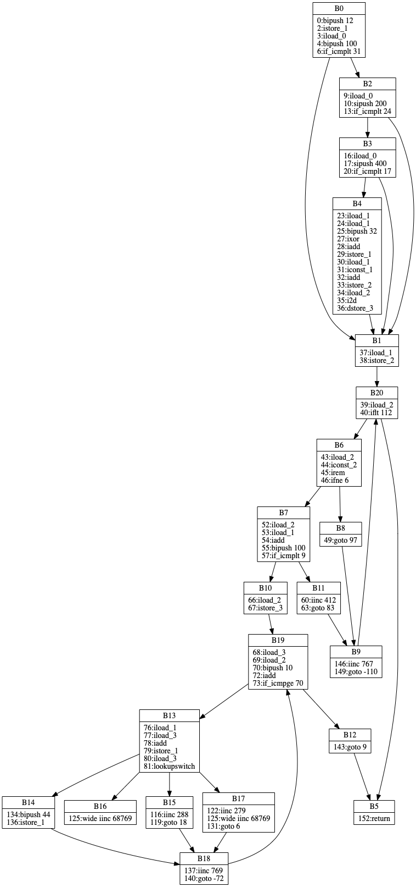

# yarrow 

## Preface
This is my graduation project, it still work in progress. I intend to write an optimizing JIT compiler for HotSpot VM. 
Thanks to [JEP243](http://openjdk.java.net/jeps/243) JVMCI, I can easily plug a compiler into
JVM at runtime with `-XX:+EnableJVMCI -XX:+UseJVMCICompiler -Djvmci.Compiler=yarrow` options.
Since JVMCI is an experimental feature and it only exposes its services to Graal compiler backend, 
which is a default implementation of JVMCI, I have to hack it so that JVMCI services can be exported 
to my yarrow module. For the sake of the simplicity, I just modify the `module-info.java` from JVMCI 
module and rebuild entire JDK. Back to my project, yarrow is highly inspired by Client Compiler for 
HotSpot VM(aka. C1). As every knows, intermediate representation are the stepping stone form what the
programmer wrote to what the machine understands. Intermediate representations must bridge a large semantic
gap. Yarrow uses a two-tiered control flow graph containing basic blocks (tier 1) of SSA
instructions(tier 2) HIR.

The whole compilation is divided into two parts. yarrow parses Java bytecode to HIR as soon as yarrow
polls a compilation task from compile queue. In order to achieve transformation, compiler finds leader
instructions and creates a control flow graph within bytecode, the minimal component of control flow grpah
is basic block, it connects to other blocks by `successors` field. Control flow graph becomes 1-Tier of HIR, you can dump the final graph by switching `-Dyarrow.Debug.PrintIRToFile=true`:



Later, a so-called [abstract interpretation](https://en.wikipedia.org/wiki/Abstract_interpretation) phase
interprets bytecode and generates corresponding SSA instructions, SSA form needs to merge different 
values of same variable. Therefore, if a basic block has more than one predecessor, PhiInstr might
be needed at the start of block. Again, you can dump graph using mentioned option:


The simple structure of the HIR allows the easy implementation of global optimizations, which are applied
both during and after the construction of HIR. Theoretically, all optimizations developed for traditional
compilers could be applied, but most of them require the analysis of the data flow and are too time-consuming for 
JIT compiler, so yarrow implements only simple and fast optimizations, that's why it is called optimizing
compiler. The most classic optimizations such as constant folding,algebraic simplification and simple constant
propagation will be applied as soon as instruction tries to insert it into a basic block
```java
VmState{lock=[],stack=[],local=[i9,i61,i16,i23,i19,null,i22,null,i45,i38,i41,i42,i58]}
i2: block_start
i16: 23
i17: i16 + i16
i19: 100
i20: i19 + i19
i22: -i20
i23: -i17
i24: 23.0
i25: 3.14
i26: -i24
i28: -i25
i30: i16 & i16
i32: i16 | i16
i34: i16 ^ i16
i36: 3
i37: new int[i36]
i38: arraylen i37
i40: 56
i41: new Object[i40]
i42: arraylen i41
i44: 4
i45: new int[i44]
i46: 0
i47: 2
i48: i45[i46] = i47 [int]
i49: 1
i50: 4
i51: i45[i49] = i50 [int]
i52: 2
i53: 5
i54: i45[i52] = i53 [int]
i55: 3
i56: 6
i57: i45[i55] = i56 [int]
i58: arraylen i45
i60: 1
i61: i10 + i60
i62: goto i3
```
Compiler idealizes many instructions, it reduces computations and chooses a simple canonical form:
```java
VmState{lock=[],stack=[],local=[i9,i63,i16,i25,i19,null,i23,null,i47,i41,i43,i45,i61]}
i2: block_start
i16: 23
i18: 46
i19: 100
i21: 200
i23: -200
i25: -46
i26: 23.0
i27: 3.14
i29: -23.0
i31: -3.14
i33: 23
i35: 23
i37: 0
i38: 3
i39: new int[i38]
i41: 3
i42: 56
i43: new Object[i42]
i45: 56
i46: 4
i47: new int[i46]
i48: 0
i49: 2
i50: i47[i48] = i49 [int]
i51: 1
i52: 4
i53: i47[i51] = i52 [int]
i54: 2
i55: 5
i56: i47[i54] = i55 [int]
i57: 3
i58: 6
i59: i47[i57] = i58 [int]
i61: 4
i62: 1
i63: i10 + i62
i64: goto i3
```
Also compiler removes unreachable blocks


Compiler uses local value numbering to find whether newly appended instruction can be replaced by previous 
instruction

```java
VmState{lock=[],stack=[],local=[i1,i1,i1,i2,i1,i3]}
i0: block_start
i2: i1 + i1
i3: i1 + i1
i4: i3 + i2
i5: return i4
```
```java
VmState{lock=[],stack=[],local=[i1,i1,i1,i2,i1,i2]}
i0: block_start
i2: i1 + i1
i4: i2 + i2
i5: return i4
```
After that, yarrow lowers HIR, it transforms machine-independent HIR instructions
to machine instructions and eliminates dead code and PHI instruction, newly created LIR plays the main 
role of code generation, instruction selection based on BURS, I'm not sure which register allocation
algorithm would be implemented. If I have enough time, I will examine a peephole optimization phase
for LIR.

## Example
Let say we have following java code, it repeats many times to calculate the sum of `[1,n]`:
```java
package com.kelthuzadx.yarrow.test;

public class ControlTest {
    public static int sum(int base) {
        int r = base;
        for (int i = 0; i < 10; i++) {
            r += i * 1 / 1;
        }
        return r;
    }
    
    public static void main(String[] args) {
        for (int i = 0; i < 999998; i++) {
            sum(i);
        }
    }
}
```
Since I only care about method *sum*, I can tell JVM my intention:
```bash
-XX:+UnlockExperimentalVMOptions
-XX:+EnableJVMCI
-XX:+UseJVMCICompiler
-Djvmci.Compiler=yarrow
-Xcomp
-Dyarrow.Debug.PrintCFG=true
-Dyarrow.Debug.PrintIR=true
-Dyarrow.Debug.PrintIRToFile=true
-XX:CompileCommand=compileonly,*SumTest.sum
```
Yarrow would output its internal intermediate representation. Furthermore, yarrow can
dump IR to `*.dot` file which can be used by [graphviz](http://www.graphviz.org/), this 
facilitates knowing what happens inside optimizing compiler.
The following firgure shows the frist step compiler does, it finds leader instructions which 
can split control flow and builds the complete control flow graph


Ater that, yarrow generates corresponding SSA instructions


