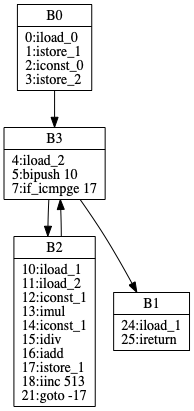
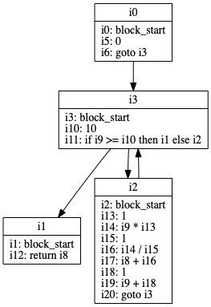

# yarrow 

## Preface
This is my graduation project. I intend to write an optimizing JIT compiler for HotSpot VM. 
Thanks to [JEP243](http://openjdk.java.net/jeps/243) JVMCI, I can easily plug a compiler into
JVM at runtime with `-XX:+EnableJVMCI -XX:+UseJVMCICompiler -Djvmci.Compiler=yarrow` options.
Since JVMCI is an experimental feature and it only exposes its services to Graal compiler backend, 
which is a default implementation of JVMCI, I have to hack it so that JVMCI services can be exported 
to my yarrow module. For the sake of the simplicity, I just modify the `module-info.java` from JVMCI 
module and rebuild entire JDK. Back to my project, the whole compilation is divided into two parts.  
yarrow parses Java bytecode to HIR as soon as yarrow polls a compilation task from compile queue,
A so-called [abstract interpretation](https://en.wikipedia.org/wiki/Abstract_interpretation) phase
interprets bytecode and generate corresponding SSA instruction, SSA form needs to merge different 
values of same variable. Therefore, if a basic block has more than one predecessor, PhiInstr might
be needed at the start of block. Analyses and classic optimization phases will be applied when 
parsing completes. After that, yarrow lowers HIR, it transforms machine-independent HIR instructions
to machine instructions and eliminates dead code and PHI instruction, newly created LIR plays the main 
role of code generation, instruction selection based on BURS, I'm not sure which register allocation
algorithm would be implemented. If I have enough time, I will examine a peephole optimization phase
for LIR.

## Optimization Technique
### 1. Constant folding
In the following SSA instruction, yarrow finds both operands of `i14` is constant
```java
VmState{lock=[],stack=[],local=[i15,i17,i12,i13]}
i2: block_start
i12: 32
i13: 31
i14: i12 + i13
i15: i7 + i14
i16: 1
i17: i8 + i16
i18: goto i3
```
Therefore, it folds constant instead of do computation


## Example
Let say we have following java code, it repeats many times to calculate the sum of `[1,n]`:
```java
package com.kelthuzadx.yarrow.test;

public class ControlTest {
    public static int sum(int base) {
        int r = base;
        for (int i = 0; i < 10; i++) {
            r += i * 1 / 1;
        }
        return r;
    }
    
    public static void main(String[] args) {
        for (int i = 0; i < 999998; i++) {
            sum(i);
        }
    }
}
```
Since I only care about method *sum*, I can tell JVM my intention:
```bash
-XX:+UnlockExperimentalVMOptions
-XX:+EnableJVMCI
-XX:+UseJVMCICompiler
-Djvmci.Compiler=yarrow
-Xcomp
-Dyarrow.Debug.PrintCFG=true
-Dyarrow.Debug.PrintIR=true
-Dyarrow.Debug.PrintIRToFile=true
-XX:CompileCommand=compileonly,*SumTest.sum
```
Yarrow would output its internal intermediate representation. Furthermore, yarrow can
dump IR to `*.dot` file which can be used by [graphviz](http://www.graphviz.org/), this 
facilitates knowing what happens inside optimizing compiler.
The following firgure shows the frist step compiler does, it finds leader instructions which 
can split control flow and builds the complete control flow graph



Ater that, yarrow generates corresponding SSA instructions


